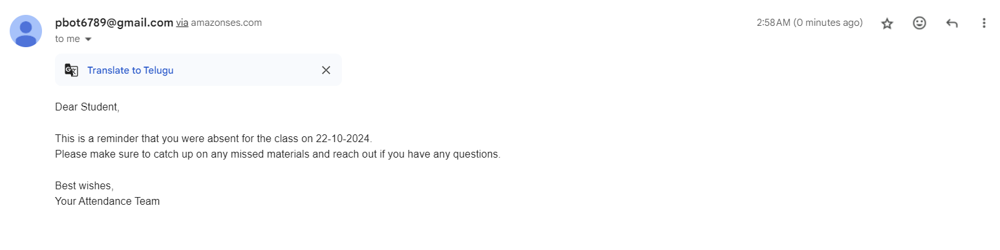
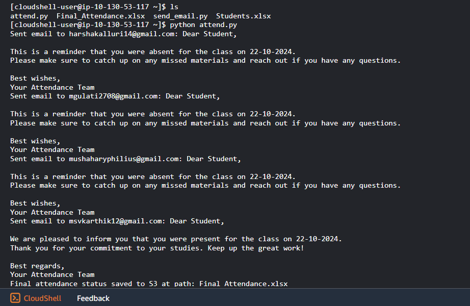
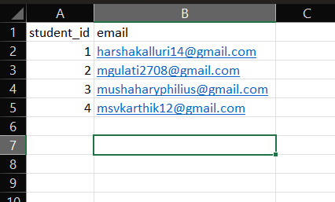
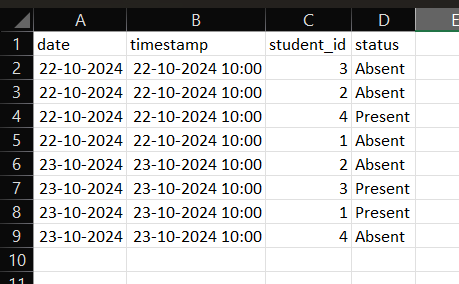

<div align="center">

# Attendance Notification System on AWS

### Reads the day's attendance from S3 and emails every student their status via SES


[What it does](#what-it-does) ·
[How it works](#how-it-works) ·
[Setup](#setup) ·
[Run it](#run-it)

</div>

---

Mark attendance in a spreadsheet, drop it in an S3 bucket, run one script — and
every student gets a personalised email about whether they were **present**,
**absent**, or **missing a record** for the day. A small, practical demo of
wiring `pandas` to AWS S3 and SES with `boto3`.

<p align="center">

</p>

## What it does

- Reads student details and attendance records from **Excel files in S3**
- Looks up each student's status for **today's date**
- Sends a tailored email via **AWS SES** — a different message for present,
  absent, and no-record cases
- Writes the processed attendance back to S3 as `Final_Attendance.xlsx`

<p align="center">

</p>

## How it works

The logic lives in [`attend.py`](attend.py):

```
Students.xlsx  ┐
               ├─▶ pandas (match by student_id + today's date) ─▶ SES email per student ─▶ Final_Attendance.xlsx → S3
Attendance.xlsx┘
```

1. Download `Students.xlsx` and `Attendance.xlsx` from the S3 bucket.
2. For each student, find today's row and read the `status` column.
3. Compose the matching message and send it with `ses_client.send_email(...)`.
4. Upload the final sheet back to S3 for record-keeping.

### The input sheets

| `Students.xlsx` | `Attendance.xlsx` |
| :---: | :---: |
|  |  |
| `student_id`, `email` | `student_id`, `date`, `status` |

## Setup

1. **Install dependencies**
   ```bash
   pip install pandas boto3 openpyxl
   ```
2. **Configure AWS** — `aws configure` with credentials that can read the S3
   bucket and send through SES. Verify your sender address in the SES console
   (required while your account is in the SES sandbox).
3. **Prepare S3** — create a bucket and upload `Students.xlsx` and
   `Attendance.xlsx`.

## Run it

Set these in [`attend.py`](attend.py) to match your setup:

```python
BUCKET_NAME        = 'your-bucket-name'
STUDENTS_FILE_KEY  = 'Students.xlsx'
ATTENDANCE_FILE_KEY= 'Attendance.xlsx'
Source             = 'you@verified-domain.com'   # your SES-verified sender
```

Then:

```bash
python attend.py
```

> **Date format:** the script matches `date` values formatted `dd-mm-yyyy`.
> Make sure the dates in `Attendance.xlsx` use the same format as today's date.

## Tech stack

AWS S3 · AWS SES · Python · pandas · boto3 · openpyxl

## License

Released under the [MIT License](LICENSE).
